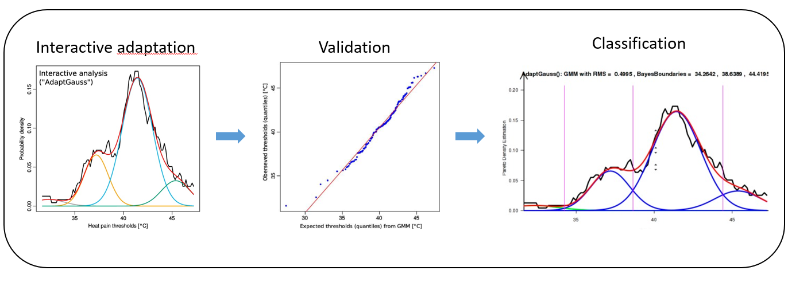
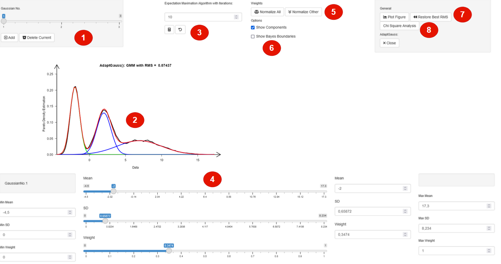
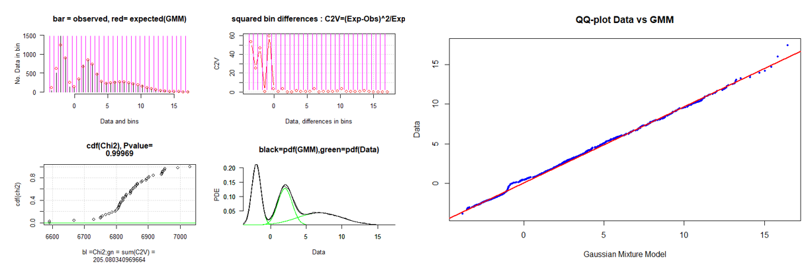

[](https://CRAN.R-project.org/package=AdaptGauss)
[](https://r-pkg.org/pkg/AdaptGauss)
[](https://r-pkg.org/pkg/AdaptGauss)

# AdaptGauss

### Table of Contents  
[1. Introduction](#introduction)  
[2. Installation](#installation)  
[3. Additional Ressources](#additional)  
[4. References](#references)  
[5. Citation](#citation)  


## 1. Introduction <a name="introduction"/>

Multimodal distributions can be modelled as a mixture of components. The model is derived using the Pareto Density Estimation (PDE) for an estimation of the pdf [[Ultsch 2005](https://www.researchgate.net/publication/227002548_Pareto_Density_Estimation_A_Density_Estimation_for_Knowledge_Discovery)]. PDE has been designed in particular to identify groups/classes in a dataset. The expectation maximization algorithm estimates a Gaussian mixture model of density states [[Bishop 2006](https://www.microsoft.com/en-us/research/uploads/prod/2006/01/Bishop-Pattern-Recognition-and-Machine-Learning-2006.pdf)] and the limits between the different states are defined by Bayes decision boundaries [[Duda 2001](https://cours.etsmtl.ca/sys843/REFS/Books/Duda_Pattern_classification.pdf)]. The model can be verified with Chi-squared test, Kolmogorov-Smirnov test and QQ plot.

The AdaptGauss package offers an interactive approach to the adaptation of Gaussian Mixture Models (GMM) and includes
- **Interactive adaptation of Gaussian Mixture Models:** Fitting GMM using the EM algorithm, with the possibility of the interactive adaption of the GMM with Shiny.
- **Evaluation of Gaussian Mixture Models:** Validate GMMs statistically and visually through statistical Tests and QQ-Plots.
- **Bayes classification:** Classify data according to Bayes boundaries.

Examples in which using only the EM algorithm for the GMM itself is insufficient, but a visual modelling approach is appropriate can be found in [[Ultsch 2015](https://www.ncbi.nlm.nih.gov/pmc/articles/PMC4632832/)].


### Workflow



Interactive adaption of a GMM, with shiny:
```{}
data = c(rnorm(3000,2,1),rnorm(3000,7,3),rnorm(3000,-2,0.5))

gmm = AdaptGauss::AdaptGauss(data, Means = c(-2, 2, 7), SDs = c(0.5, 1, 4),
```

### Interactive Implementation in Shiny
1. Selection of Gaussian component
2. Visualization of Model probability density function (pdf), pdf of each component of the GMM, and the data density estimation
3. Settings to execute an Expectation-Maximization algorithm
4. Adjust the parameters of the current Gaussian component (with sliders or direct numeric input)
5. Control the weights of the components (normalize all equally or only the others (excluding the current one) with respect to the weight of the current component)
6. Control for visualization (show the Bayesian Boundaries or the components pdf)
7. Control of the current setting: Restoring last best overall value (based on the 'Root Mean Squared Error'
8. Control of the current setting: Create a plot or execute a chi square analysis for evaluation of the setting



### Evaluation

The GMM can than be checked for statistical significance, for example using a version of the Chi-Square-test.
```{}
AdaptGauss::Chi2testMixtures(data, gmm$Means,gmm$SDs,gmm$Weights,PlotIt=T)

AdaptGauss::QQplotGMM(data,gmm$Means,gmm$SDs,gmm$Weights)
```




## 2. Installation <a name="installation"/>

#### Installation using CRAN
Install automatically with all dependencies via

```R
install.packages("AdaptGauss",dependencies = T)
```

#### Installation using Github
Please note, that dependecies have to be installed manually.

```R
remotes::install_github("Mthrun/AdaptGauss")
```

#### Installation using R Studio
Please note, that dependecies have to be installed manually.

*Tools -> Install Packages -> Repository (CRAN) -> AdaptGauss*


## 3. Additional Resources <a name="additional"/>

- For further examples see [Vignette](https://cran.r-project.org/web/packages/AdaptGauss/vignettes/AdaptGauss.html)
- [Package Documentation](https://cran.r-project.org/web/packages/AdaptGauss/AdaptGauss.pdf)
- View package on [CRAN](https://cran.r-project.org/web/packages/AdaptGauss/index.html)


## 4. References <a name="references"/>

[Ultsch 2005] Ultsch, A.: Pareto density estimation: A density estimation for knowledge discovery, in Baier, D.; Werrnecke, K. D., (Eds), Innovations in classification, data science, and information systems, Proc Gfkl 2003, pp 91-100, Springer, Berlin, 2005.

[Bishop 2006] Bishop, Christopher M. Pattern recognition and machine learning. springer, 2006, p 435 ff

[Duda 2001] Duda, R.O., P.E. Hart, and D.G. Stork, Pattern classification. 2nd. Edition. New York, 2001, p 512 ff

[Ultsch 2015] Ultsch, A., Thrun, M. C., Hansen-Goos, O., & Lotsch, J. : Identification of Molecular Fingerprints in Human Heat Pain Thresholds by Use of an Interactive Mixture Model R Toolbox (AdaptGauss), International journal of molecular sciences, Vol. 16(10), pp. 25897-25911, 2015. 


## 5. Citation <a name="citation"/>
Please use the following citation:

Thrun, M. C., & Ultsch, A. : Models of Income Distributions for Knowledge Discovery, Proc. European Conference on Data Analysis (ECDA), DOI: 10.13140/RG.2.1.4463.0244, pp. 136-137, Colchester, 2015. 

Ultsch, A., Thrun, M. C., Hansen-Goos, O., & Lotsch, J. : Identification of Molecular Fingerprints in Human Heat Pain Thresholds by Use of an Interactive Mixture Model R Toolbox (AdaptGauss), International journal of molecular sciences, Vol. 16(10), pp. 25897-25911, 2015. 

